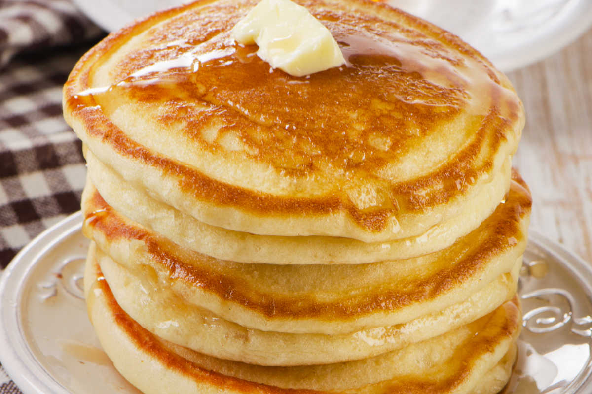

# Buttermilk Pancakes 

We will be making the best fluffy pancakes using the recipe below!

- Flour 
- Baking powder
- Sugar 
- Salt
- Milk 
- Butter
- Egg

Instructions:
1. Mix Dry Ingredients: Combine 1 cup flour, 2 tbsp sugar, 1 tsp baking powder, 1/2 tsp baking soda, and 1/4 tsp salt.
2. Mix Wet Ingredients: Whisk 1 cup buttermilk, 1 egg, 2 tbsp melted butter, and 1/2 tsp vanilla (optional).
3. Combine: Stir wet into dry until just mixed (lumpy is fine).
4. Cook: Pour batter onto a hot greased pan, cook until bubbles form, flip, and cook until golden.
5. Serve: Enjoy warm with your favorite toppings!